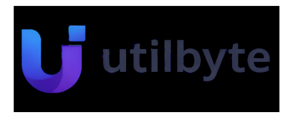

<p align="center">
  
</p>

<h1 align="center">UtilByte</h1>

<p align="center">
  <strong>Free, privacy-first online tools that run entirely in your browser.</strong>
</p>

<p align="center">
  <a href="https://utilbyte.app">Live App</a> &bull;
  <a href="#features">Features</a> &bull;
  <a href="#getting-started">Getting Started</a> &bull;
  <a href="#contributing">Contributing</a> &bull;
  <a href="#license">License</a>
</p>

<p align="center">
  
  
  
  
  
</p>

---

UtilByte is an open-source browser-based utility toolkit with **45+ tools** across image, PDF, text, developer, utility, and video categories. Every tool processes data **locally in your browser** — your files never leave your device.

## Features

- **100% Client-Side** — All processing happens in the browser. No server uploads, no data collection.
- **45+ Tools** — Comprehensive coverage across 6 categories.
- **Dark & Light Modes** — Full theme support with system preference detection.
- **Responsive** — Works on desktop, tablet, and mobile.
- **No Sign-Up** — No accounts, no subscriptions, no paywalls.
- **Fast** — Built with Next.js 16 (Turbopack) and optimized for Core Web Vitals.

### Tool Categories

| Category | Tools | Examples |
|----------|-------|----------|
| **Image** | 7 | Compress, Crop, Resize, Format Convert, Background Remove, Blur, OCR |
| **PDF** | 7 | Merge, Split, Compress, Rotate, Edit, PDF↔Image conversion |
| **Text** | 5 | Word Counter, Case Converter, Lorem Ipsum, Text Formatter, Remove Duplicates |
| **Developer** | 16 | JSON Formatter, Base64, JWT Decoder, Regex Tester, Diff Checker, Hash Generator, Cron Parser, UUID Generator, URL Encoder, Markdown Renderer, Code Beautifier, SQL Formatter, WebSocket Client, Online Compiler, API Client, Request Catcher |
| **Utility** | 7 | QR Code, Barcode, Password Generator, Color Converter, Unit Converter, Timestamp, Countdown |
| **Video** | 3 | Compress Video, Video to Audio, Video to GIF |

## Tech Stack

| Layer | Technology |
|-------|------------|
| Framework | [Next.js 16](https://nextjs.org/) (App Router) |
| Language | [TypeScript 5](https://www.typescriptlang.org/) |
| UI Library | [React 19](https://react.dev/) |
| Styling | [Tailwind CSS 4](https://tailwindcss.com/) |
| Components | [Radix UI](https://www.radix-ui.com/) + [shadcn/ui](https://ui.shadcn.com/) patterns |
| Icons | [Lucide React](https://lucide.dev/) |
| Animations | [Framer Motion](https://www.framer.com/motion/) |
| Forms | [React Hook Form](https://react-hook-form.com/) + [Zod](https://zod.dev/) |
| PDF Processing | [pdf-lib](https://pdf-lib.js.org/), [PDF.js](https://mozilla.github.io/pdf.js/) |
| Image OCR | [Tesseract.js](https://tesseract.projectnaptha.com/) |
| Video Processing | [FFmpeg.wasm](https://ffmpegwasm.netlify.app/) |
| Charts | [Recharts](https://recharts.org/) |
| Monitoring | [Sentry](https://sentry.io/) |
| Analytics | [Vercel Analytics](https://vercel.com/analytics) |

## Getting Started

### Prerequisites

- **Node.js** 18.18+ (LTS recommended)
- **npm** 9+ (or pnpm / yarn)

### Installation

```bash
# Clone the repository
git clone https://github.com/KryssNa/utilbyte.git
cd utilbyte

# Install dependencies
npm install

# Start the development server
npm run dev
```

Open [http://localhost:3000](http://localhost:3000) in your browser.

### Environment Variables

Copy the example environment file and fill in the values you need:

```bash
cp .env.example .env.local
```

See [`.env.example`](.env.example) for all available variables. **Most tools work without any environment variables** — only a handful of features (Supabase-backed dev tools, analytics, Sentry) require configuration.

### Scripts

| Command | Description |
|---------|-------------|
| `npm run dev` | Start dev server with Turbopack on port 3000 |
| `npm run build` | Production build |
| `npm start` | Start production server |
| `npm run type-check` | Run TypeScript compiler checks |

## Project Structure

```
utilbyte/
├── public/                  # Static assets (logo, PDF worker, ads.txt)
├── src/
│   ├── app/                 # Next.js App Router pages
│   │   ├── layout.tsx       # Root layout (fonts, metadata, providers)
│   │   ├── page.tsx         # Homepage
│   │   ├── robots.ts        # robots.txt generation
│   │   ├── sitemap.ts       # sitemap.xml generation
│   │   ├── dev-tools/       # Developer tool pages
│   │   ├── image-tools/     # Image tool pages
│   │   ├── pdf-tools/       # PDF tool pages
│   │   ├── text-tools/      # Text tool pages
│   │   ├── utility-tools/   # Utility tool pages
│   │   ├── video-tools/     # Video tool pages
│   │   ├── about/           # About page
│   │   ├── contact/         # Contact page
│   │   ├── privacy/         # Privacy policy
│   │   ├── terms/           # Terms of service
│   │   └── api/             # API routes (contact form)
│   ├── components/
│   │   ├── layout/          # Navbar, Footer, navigation data
│   │   ├── providers/       # ThemeProvider
│   │   ├── shared/          # Reusable tool components (ToolLayout, FileDropZone)
│   │   ├── tools/           # Tool implementations by category
│   │   │   ├── dev/         # Developer tool components
│   │   │   ├── image/       # Image tool components
│   │   │   ├── pdf/         # PDF tool components
│   │   │   ├── text/        # Text tool components
│   │   │   ├── utility/     # Utility tool components
│   │   │   └── video/       # Video tool components
│   │   └── ui/              # shadcn/ui primitives (~35 components)
│   ├── hooks/               # Custom React hooks
│   └── lib/                 # Utility functions (cn, formatFileSize, etc.)
├── next.config.ts           # Next.js configuration + Sentry
├── tailwind.config.ts       # Tailwind CSS configuration
├── tsconfig.json            # TypeScript configuration
└── package.json
```

### Architecture

Each tool follows a consistent pattern:

1. **Page** (`src/app/{category}/{tool}/page.tsx`) — Exports metadata (SEO) and renders the tool component.
2. **Component** (`src/components/tools/{category}/{ToolName}.tsx`) — The tool's UI and logic. Wrapped in `ToolLayout` for a consistent page structure.
3. **Shared components** (`src/components/shared/`) — `ToolLayout`, `FileDropZone`, `RelatedTools`, and `SocialProof` provide consistent UX across all tools.

All tool processing runs in the browser using Web APIs, WebAssembly (FFmpeg, Tesseract), or JavaScript libraries (pdf-lib, crypto-js, etc.).

## Contributing

We welcome contributions! Please read our [Contributing Guide](CONTRIBUTING.md) to learn about our development process, how to propose changes, and how to build and test your changes.

### Quick Start for Contributors

```bash
# Fork the repo and clone your fork
git clone https://github.com/<your-username>/utilbyte.git
cd utilbyte
npm install
npm run dev

# Create a branch for your changes
git checkout -b feat/my-new-tool

# After making changes, verify everything works
npm run type-check
npm run build
```

See [CONTRIBUTING.md](CONTRIBUTING.md) for detailed instructions on adding new tools, code style, and the pull request process.

## License

This project is licensed under the [MIT License](LICENSE).

## Acknowledgements

Built with these incredible open-source projects:

- [Next.js](https://nextjs.org/) — The React framework
- [Tailwind CSS](https://tailwindcss.com/) — Utility-first CSS
- [Radix UI](https://www.radix-ui.com/) — Accessible UI primitives
- [shadcn/ui](https://ui.shadcn.com/) — Beautiful component patterns
- [Lucide](https://lucide.dev/) — Consistent icon set
- [pdf-lib](https://pdf-lib.js.org/) — PDF manipulation
- [Tesseract.js](https://tesseract.projectnaptha.com/) — OCR in the browser
- [FFmpeg.wasm](https://ffmpegwasm.netlify.app/) — Video processing in the browser
